# BCSC-Postman OAuth 2.0
A Postman collection for authenticating to the BCSC API. 

## Steps to get up and running
Follow these steps to quickly test out your access to the BC Services Card OIDC environment

### 1. Get an OAuth2 (OIDC)  key and secret for your application from the BC Services Card Self Service site (<insert url>)
Lets assume that these are called "Client key" and "Client secret". Remember your redirect URL "Redirect URL" and the scopes you have requested. You also need to remember whether you are encrypting or signing  the response or whether you require the response in JWT or JSON format. The signing parameters (id_token_signed_response_alg,  userinfo_signed_response_alg) are linked to the JWKS URL and the encryption parameters (id_token_encrypted_reponse and userinfo_encrypted_response ) determine whether the response is encrypted. 

### 2. Import the BCSC OAuth 2.0 collection and BCSC environment into Postman
If you don't have a Desktop version of Postman installed, do so from here :

https://www.postman.com/downloads/


Once you have Postman on your desktop,click the button below and select the Desktop version of Postman (Chrome extension doesn't support environment variables). This will also install the Collection and Environment we'll be using.

[](https://app.getpostman.com/run-collection/715f6c5fd3d4ce3511f9)

Alternatively, you can download the BCSC OAuth2.0.postman_collection and BCSC 2.0.postman_environment JSON files from this github project and import them via the Import button in the top left of the Postman Workplace sceen.

### 3. Add your environment variables in Postman
Copy your Client id, Client secret, redirect URI and scopes from the BC Services Card Self Service site into the environment variables in Postman.


Set your environment and environment variables: 
* Press the eye button   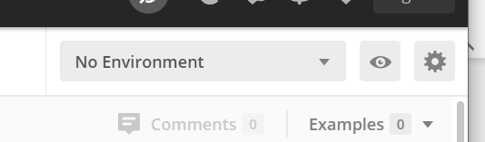  
* Add an environment  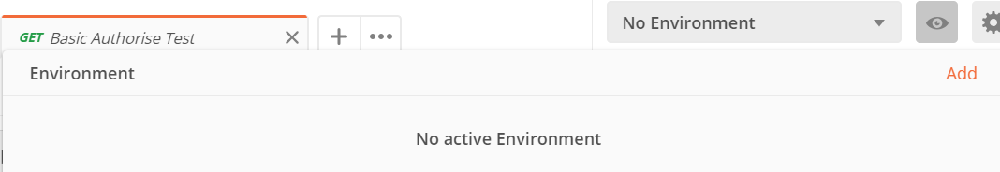
* Clicking add will present 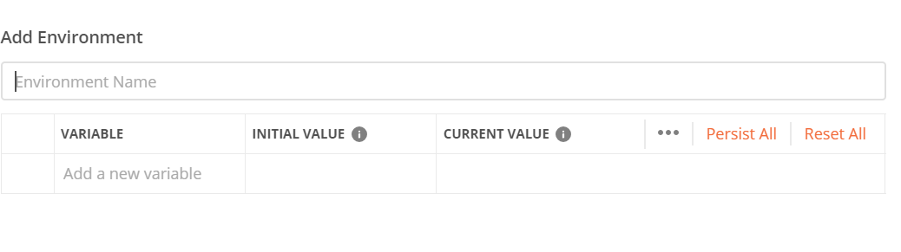
* Map the following:
  * Environment Name: BCSC OAuth2.0 
  * authURI = https://idtest.gov.bc.ca/login/oidc/authorize
  * state = somestate
  * access_token = null
  * refresh_token = null
  * accessTokenURI = https:://idtest.gov.bc.ca/oauth2/token

the following will need to come from your BC Services Card Self Service Dev Request 

* client_id --> see arrow below
* client_secret --> see arrow below
 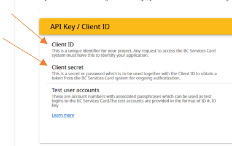

* Scope= Openid profile 
* Redirect URI -> redirect_uri 

In postman it should look like this
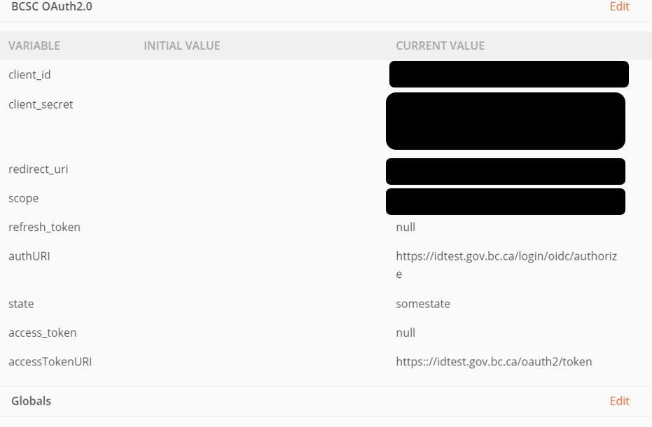  


### 4. Test that your client id and redirect url are ok
1. Click on the "Basic Authorise Test" GET request under the BCSC OAuth 2.0 Collection
1. Click "Send"
1. Click on the Test Results tab

You should get a response with a green "Pass" logo . If it fails you will get a bunch of red html, you may be able to determine what the cause is, most likely your Client Id is wrong or your Redirect URL is incorrect.

You will need to confirm</br>
a) Your environment </br>
b)	Basic Authorise Test</br>
c)	Press send</br>
d)	Navigate to Test Results</br>
e)	See a green pass button</br>
 
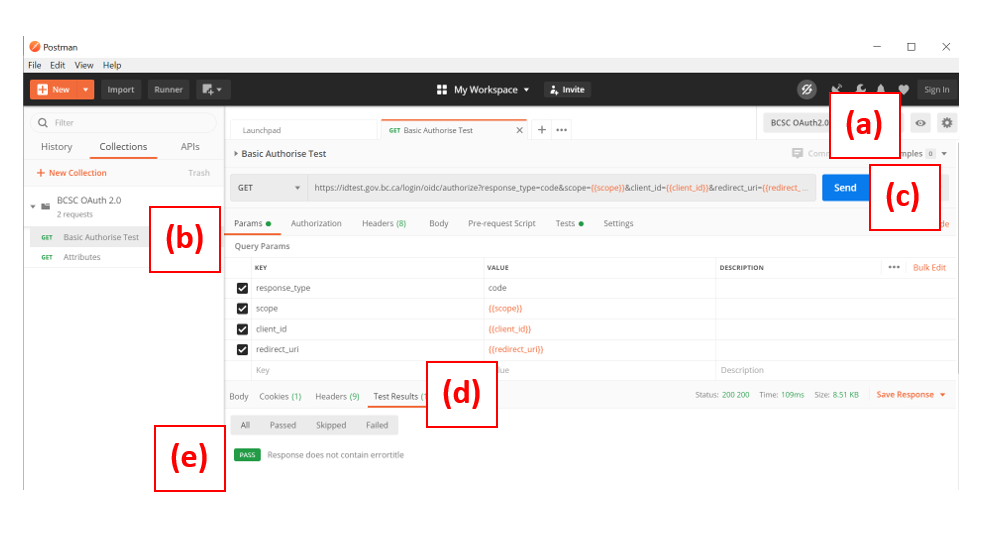


### 5. Do a full test by getting your user attributes (NB. You will need a test account which you should have received from the BC Services Card Self Service site )

1. Click on the "GET Attributes" request under the BCSC OAuth 2.0 Collection
1. Select the tab "Authorisation" . Ensure that the Type is set to OAuth 2.0
1. Click on the "Get new Access Token" button

You will need to confirm</br>
a)	Your environment</br>
b)	Attributes</br>
c)	Authorization</br>
d)	Type</br>
e)	Get new access tokens -- It is helpful if you turn on the  postman console View --> Postman Console or ALT+ CTRL +C </br>

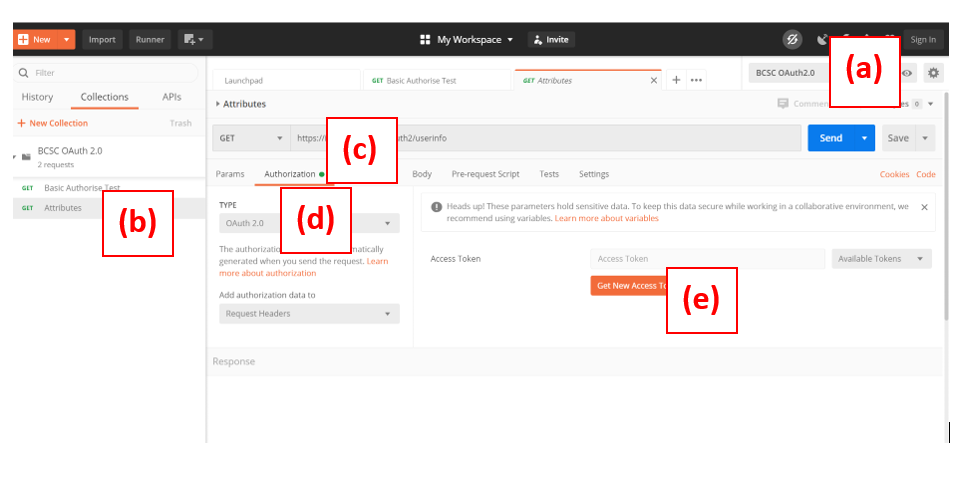


Add values for each of the fields as follows (yes, type the curly brackets too ) :

```
Token Name : mytoken
Grant Type : Authorization Code
Callback URL : {{redirect_uri}}
Auth URL : {{authURI}}
Access Token URL :  {{accessTokenURI}}
Client ID : {{client_id}}
Client Secret : {{client_secret}}
Scope : {{scope}}
State : 1234
Client Authentication :  Send as Basic Auth header
```

Note : For each of the fields presented (the {{...}} gets replaced by the variables you have already defined in step 3 above )  - and this is remembered so that you can simply change your environment if necessary without redoing the current step.


Once done, you can click "Request Token" and if all is well , you will be redirected to the standard login screens requesting your BCSC credentials.
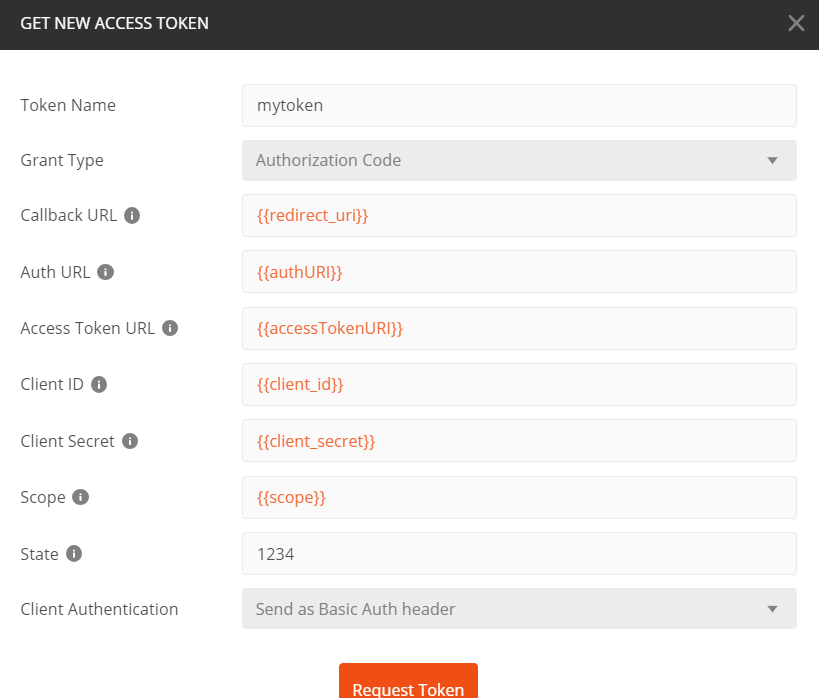

Using your test account data as a virtual card login, complete the login steps.
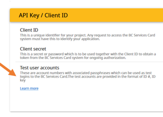</br>


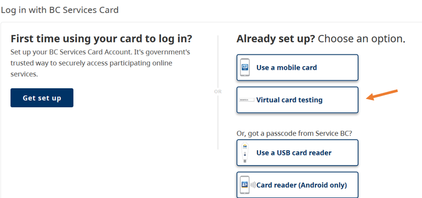</br>
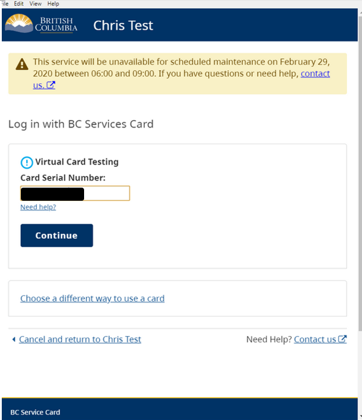</br>
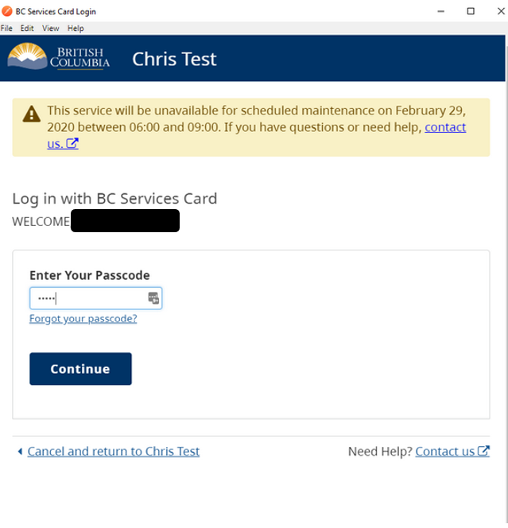</br>
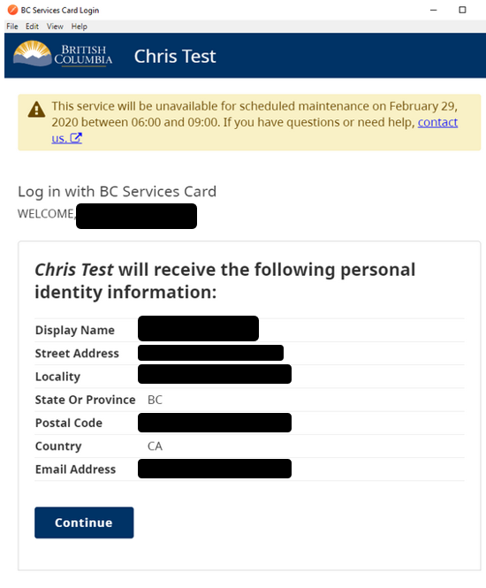</br>


 If all goes well, you will be returned a token which will be shown as an available token
 </br>
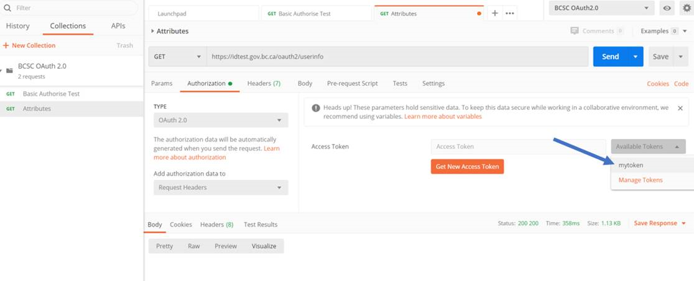</br>
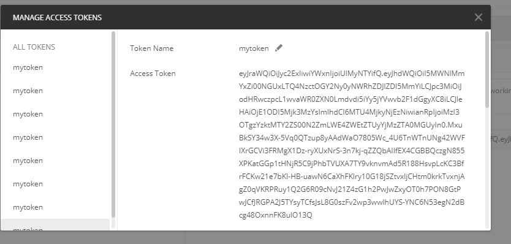</br>


Now the fun part - simply click on "Send" for the request and you should get your user attributes returned - note that postman automatically adds your access token returned in the previous step , so you do not need to add anything manually to the GET request header. 

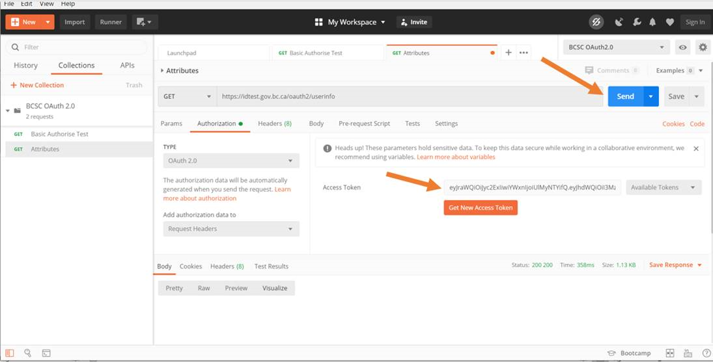</br>
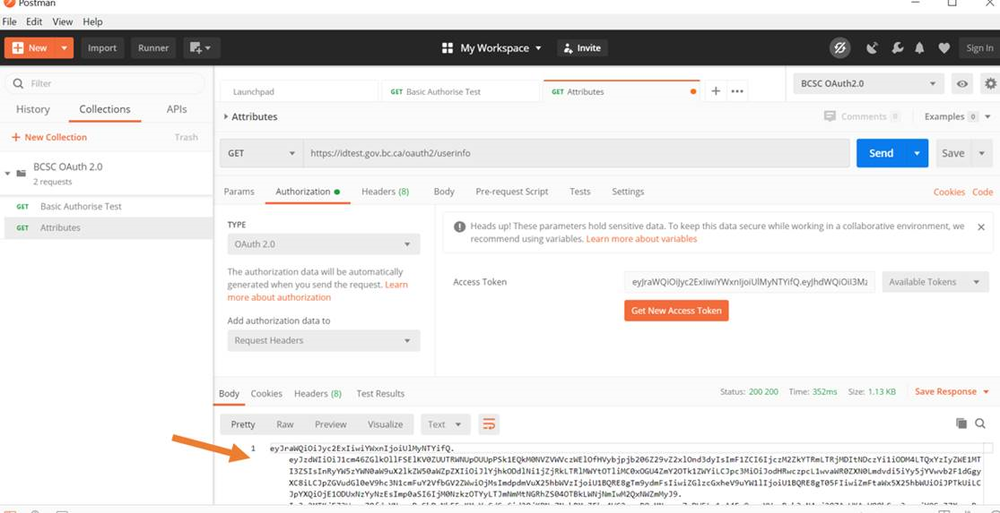</br>


Note: Depending on your encryption settings which you set up in the BC Services Card Self Service application, the attributes returned could be encrypted, returned as a JWT token or returned as JSON. 

Note : To see the contents of a JWT token you can decode using eg.  https://jwt.io 

You can verify that the data returned is the same as that displayed during the BC Services Card login process, and that the scopes are limited to those set up in your BC Services Card Self Service application

